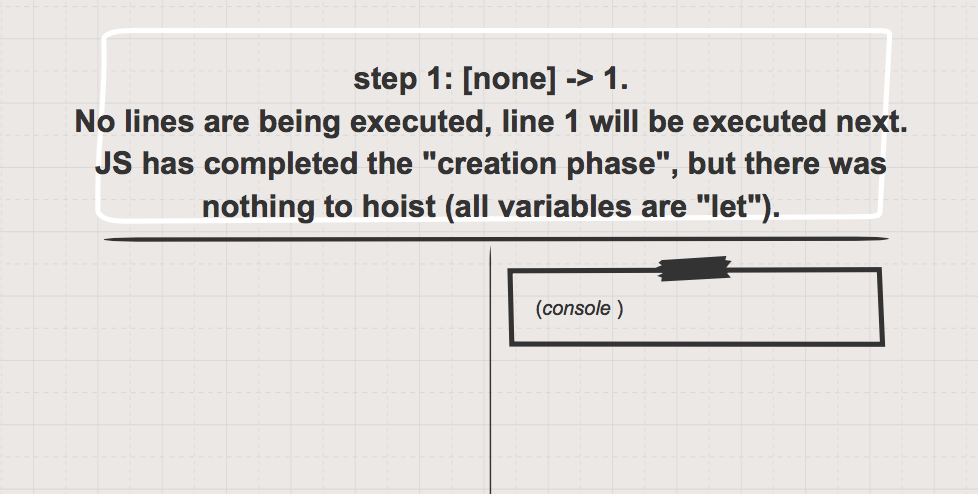
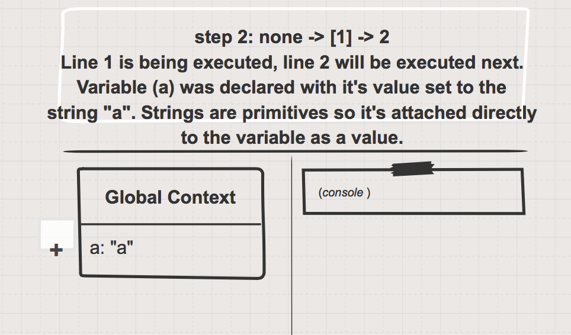
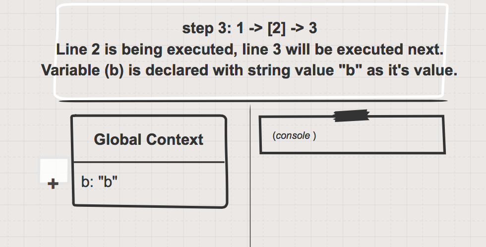
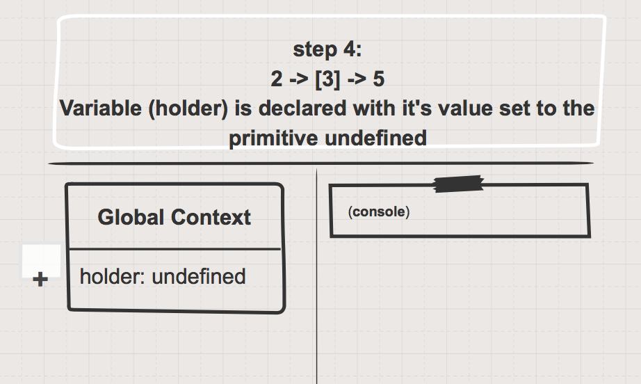
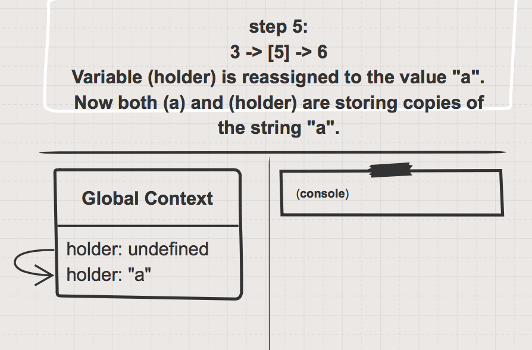
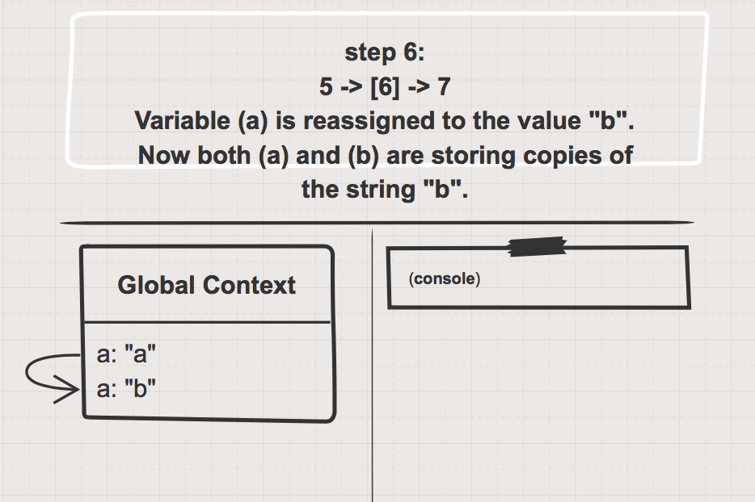
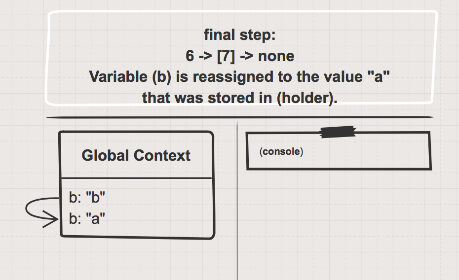
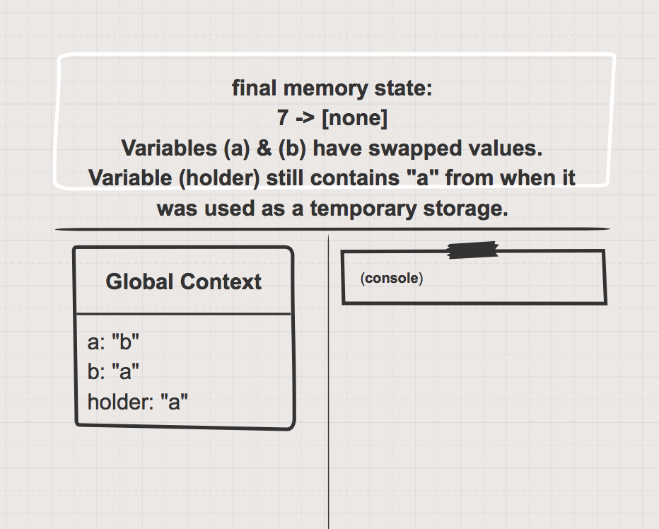

## Value Swap

Swapping values between two variables using a third variable is a great measure of how well you understand variables and assignment statements.  If you understand these concepts, this example will seem overly simple.  If not, this example may be challenging to understand.

___
 
### The Code

```js
let a = 'a';
let b = 'b';
let holder = undefined;

holder = a;
a = b;
b = holder;
```

[Live PyTut link](https://goo.gl/AEWUqm)

[Parsons Practice](https://janke-learning.github.io/parsonizer/?challenge=108-101-116-32-97-32-61-32-39-97-39-59-10-108-101-116-32-98-32-61-32-39-98-39-59-10-108-101-116-32-104-111-108-100-101-114-32-61-32-117-110-100-101-102-105-110-101-100-59-10-10-104-111-108-100-101-114-32-61-32-97-59-10-97-32-61-32-98-59-10-98-32-61-32-104-111-108-100-101-114-59)

___

### The Sketches









___



___
___
### <a href="http://janke-learning.org" target="_blank"></img> Janke Learning</a>


